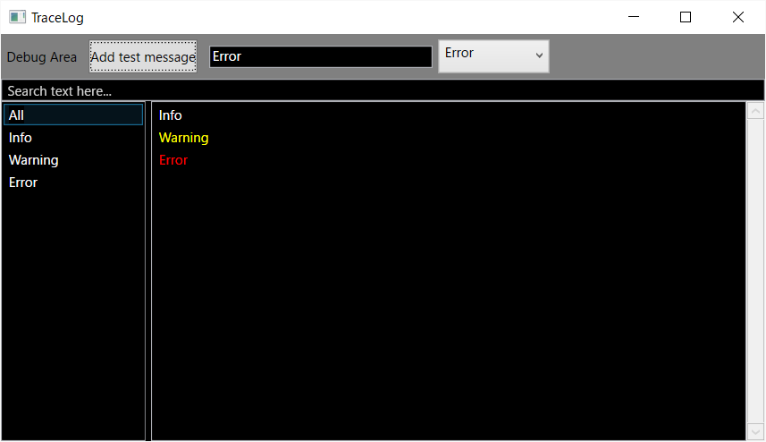

# StackTrace
This project demonstrates a WPF-built-in stack trace.



## Getting Started
### Prerequisites
*  VS2017  
*  C# 6.0 or later

### Installing
Just pull or download this project.

## Example
```csharp
using static namespace TracelogTest.Model.Command;

// Show information
Info("Information");

// Show warning
Warning("Warning");

// Show error
Error("Error");
```

## Author
nossey